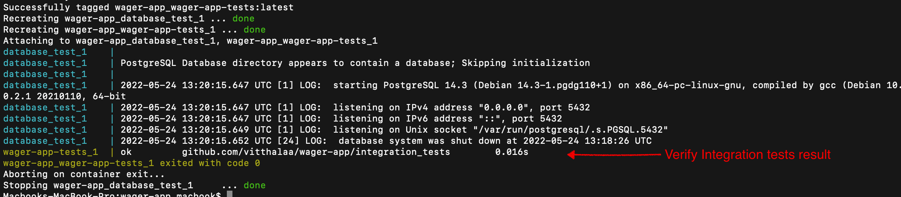

# Wager App

## Using Docker
### Verify docker build using integration tests
It will use `docker-copose.test.yaml` and `Dockerfile.test` to run integration tests.

Run following command to run integration test using docker.
- `docker-compose -f docker-compose.test.yaml up --build --abort-on-container-exit --force-recreate`
  - OR using make: `make docker-verify`

  

### Run
- At root of project, run `docker-compose up` or `docker-compose up -d` in detach mode.
  - OR using make: `make docker-run`
- **Note**: Recreate volumes if database is not created in container while docker up: `docker-compose up -V`

## Without Docker
How to set up and run locally without docker.

### Prerequisites
- Golang version 1.6 and above
- Postgres version 14 and above
#### For development
- Install mockery v2 latest version as per [doc](https://github.com/vektra/mockery)
    - Required for generating mocks from interfaces for writing new unit tests.
    - Not needed to run application

### Setup
1. Make changes to `.env` values as per your config and requirements.
2. Setup Database
    1. For first time, create a postgres database and put credentials in `.env` file.
    2. Also create table using `./data/init_database.sql`
3. Verify setup by running integration tests
    - `go test ./integration_tests/ -tags=integration`
      - OR run `make integration-test`

### Run
- Run application from root `go run main.go`
  - OR `make run`

#### By build
1. `go build -o wager-app` OR `make build`
2. `./wager-app`

## Architecture
#### Directory Structure
`./` _Root_
- `./main.go`: _entry point for app._
- `./app_errors/`: _errors/error codes communicated to outside world._
- `./dto/`: _data transfer objects communicated to outside world._
- `./data/`: _data resources for app. Ex initial db data, migrations etc._
- `./integration_tests/`: _integration tests to verify sanity of app in any environment. Build/deployment should not happen on failure_
- `./internal/`: _packages within app scope and should not be exposed to outside._
    - `./internal/config/`: _app configurations and related operations._
    - `./internal/db/`: _database related operations._
    - `./internal/handlers/`: _rest request handlers._
    - `./internal/integrations/`: _other services/3rd party integrations._
    - `./internal/services/`: _service layer to handle business logic._